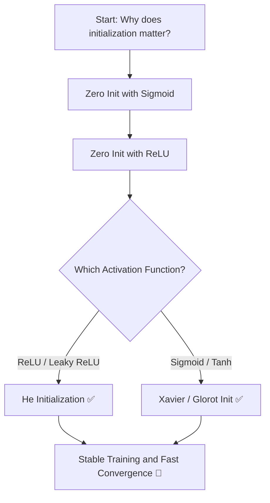

<div align="center">

# ⚖️ Weight Initialization Techniques in 

### A Deep Learning Practice 

[](https://www.python.org/)
[](https://www.tensorflow.org/)
[](https://keras.io/)
[](https://jupyter.org/)
[](https://numpy.org/)
[](LICENSE)

<br/>

> *Exploring how the choice of weight initialization can make or break your neural network — from vanishing gradients to stable, fast convergence.*

<br/>

[📖 Overview](#-overview) • [💡 Why It Matters](#-why-weight-initialization-matters) • [✨ Techniques Covered](#-techniques-covered) • [📁 Project Structure](#-project-structure) • [🚀 Getting Started](#-getting-started) • [🔧 Requirements](#-requirements)

---

</div>

## 📖 Overview

Weight initialization is one of the most critical — yet often overlooked — steps in training a neural network. A poor initialization strategy can lead to **vanishing or exploding gradients**, causing the network to train extremely slowly or fail to converge entirely.

This repository systematically explores different weight initialization strategies applied to Artificial Neural Networks (ANNs), comparing their behavior across different activation functions (ReLU vs. Sigmoid) and demonstrating their real-world impact on training performance.

<br/>

## 💡 Why Weight Initialization Matters

```
Poor Initialization ──────────────────────────────── Good Initialization
        │                                                     │
        ▼                                                     ▼
  Vanishing /                                         Stable Gradients
Exploding Gradients                                  Fast Convergence
  Slow / No Training                               Better Generalization
```

When weights are initialized to **all zeros**, neurons in the same layer produce identical gradients — a problem known as the **symmetry problem** — and the network fails to learn. Techniques like **He** and **Xavier (Glorot)** initialization are specifically designed to break this symmetry and keep signal variance stable across layers.

<br/>

## ✨ Techniques Covered

| # | Technique | Best For | Notebook |
|---|-----------|----------|----------|
| 1 | **Zero Initialization** | Demonstrating failure cases | `zero_initialization_sigmoid.ipynb` |
| 2 | **Zero Initialization + ReLU** | Observing activation collapse | `zero_initialization_relu.ipynb` |
| 3 | **He Initialization** | ReLU & variants (deep networks) | `(weight) He Initialization DL .ipynb` |
| 4 | **Xavier / Glorot Initialization** | Sigmoid & Tanh activations | `Untitled26.ipynb` |

<br/>

### 🔍 Quick Reference: Initialization Formulas

| Method | Formula | Recommended Activation |
|--------|---------|------------|
| **Zero** | W = 0 | ❌ Breaks symmetry — avoid |
| **He Normal** | W ~ N(0, sqrt(2 / n_in)) | ReLU, Leaky ReLU, ELU |
| **Xavier / Glorot** | W ~ U(-sqrt(6 / (n_in + n_out)), +sqrt(6 / (n_in + n_out))) | Sigmoid, Tanh |

<br/>

## 📁 Project Structure

```
📦 Weight-Initialization-techniques-In-ANN-DL
│
├── 📓 zero_initialization_sigmoid.ipynb          # Zero init with Sigmoid — symmetry problem demo
├── 📓 zero_initialization_relu.ipynb             # Zero init with ReLU — dead neuron problem demo
├── 📓 (weight) He Initialization DL .ipynb       # He init — optimal for ReLU-based networks
├── 📓 Untitled26.ipynb                           # Xavier/Glorot init — optimal for Sigmoid/Tanh
│
└── 📄 README.md
```

<br/>

## 🚀 Getting Started

### 1. Clone the Repository

```bash
git clone https://github.com/sanzidd/Weight-Initialization-techniques-In-ANN-DL.git
cd Weight-Initialization-techniques-In-ANN-DL
```

### 2. Install Dependencies

```bash
pip install tensorflow keras numpy pandas matplotlib jupyter
```

### 3. Launch Jupyter Notebook

```bash
jupyter notebook
```

> 💡 **Recommended order:** Start with `zero_initialization_sigmoid.ipynb` to see *why* initialization matters, then progress through `zero_initialization_relu.ipynb` → He Initialization → Xavier Initialization to observe the improvements at each step.

<br/>

## 🧪 Experiment Insights

### ❌ Zero Initialization — What Goes Wrong

```python
# All neurons produce the same output → identical gradients → no learning
kernel_initializer='zeros'
```
- Every neuron in a layer learns the **same feature** (symmetry problem)
- Gradients are identical → weights update identically → network stays symmetric
- The model behaves as if it were a **single-neuron network**

---

### ✅ He Initialization — Designed for ReLU

```python
# Variance scaled to account for ReLU killing ~50% of neurons
kernel_initializer='he_normal'
```
- Scales variance by `2/n` to compensate for ReLU's zero-output region
- Prevents **vanishing gradients** in very deep networks
- Recommended default for **ReLU, Leaky ReLU, ELU** activations

---

### ✅ Xavier / Glorot Initialization — Designed for Sigmoid/Tanh

```python
# Keeps signal variance consistent across layers in both forward & backward pass
kernel_initializer='glorot_uniform'
```
- Balances variance between input and output layers
- Prevents saturation in **Sigmoid** and **Tanh** activations
- Keras default initializer for most dense layers

<br/>

## 🔧 Requirements

```
Python        >= 3.8
TensorFlow    >= 2.0
Keras         (bundled with TensorFlow 2.x)
NumPy         >= 1.19
Matplotlib    >= 3.3
Jupyter       >= 1.0
```

<br/>

## 📈 Learning Workflow



<br/>

## 🤝 Contributing

Found a bug or want to add more initialization techniques (e.g., LeCun, Orthogonal)? Contributions are welcome!

1. Fork the repository
2. Create a new branch: `git checkout -b feature/lecun-init`
3. Commit your changes: `git commit -m "Add: LeCun initialization notebook"`
4. Push and open a Pull Request

<br/>

## 📄 License

This project is open-source and available under the **MIT License**.

<br/>

<div align="center">

---

Made with ❤️ by [sanzidd](https://github.com/sanzidd)

*If this helped your understanding of deep learning, drop a ⭐ — it goes a long way!*

</div>
